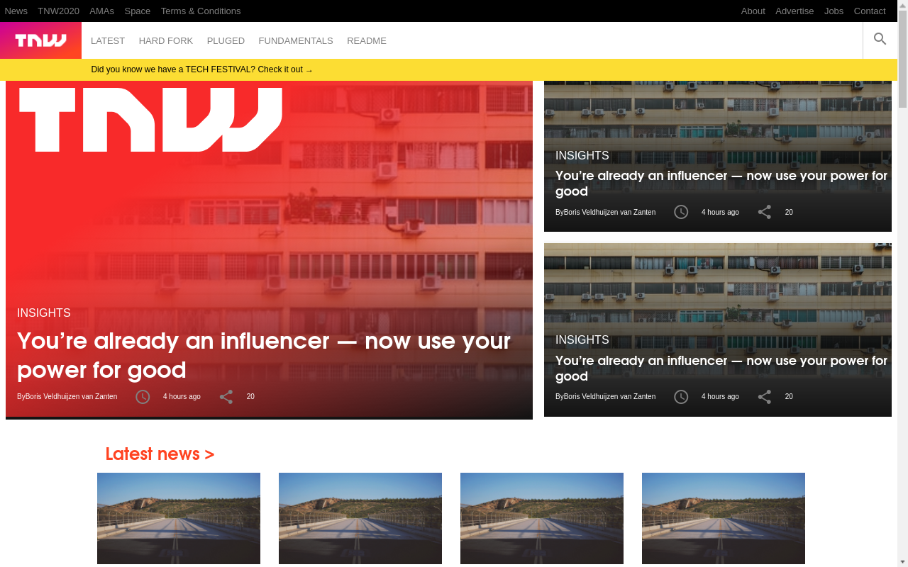
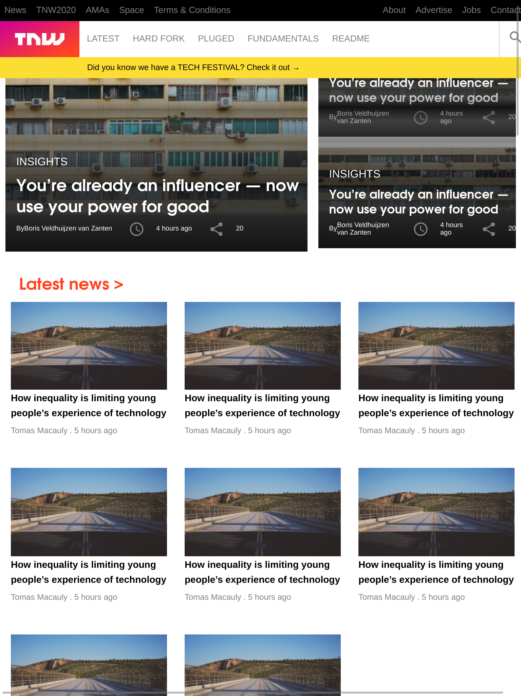
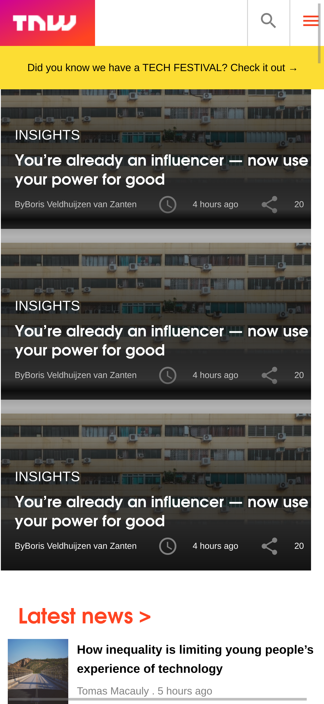

# responsive-tnw-clone
>Implementation of a responsive web page using TNW's website as example

- Responsive Web page using CSS/HTML tools.
- 3 wiewport sices were used as breakpoints: 
  - Less than 768px
  - Between 768 and 1024px
  - Greater than 1024px
- Formating was done by using Grids and flex reponding to different CSS Media queries

## Built With

- CSS/HTML
- Flex, Grid and Media Queries

## Live Demo

[Live Demo Link](https://raw.githack.com/gdumani/responsive-tnw-clone/feature/index.html)

### Prerequisites
Modern browser
- It was tested on Chrome 80 and Firefox 73

## Authors

👤 **Author1**
Oloo Moses

- Github: [@githubhandle](https://github.com/oloomoses)
- Twitter: [@twitterhandle](https://twitter.com/olooine)
- Linkedin: [linkedin](https://www.linkedin.com/in/oloo-moses-528bb1b3/)

👤 **Author2**
Giancarlo Dumani

- Github: [@githubhandle](https://github.com/gdumani)
- Twitter: [@twitterhandle](https://twitter.com/gdumani1)
- Linkedin: [linkedin](https://www.linkedin.com/in/giancarlo-dumani-a7364a1a1/)

## 🤝 Contributing

Contributions, issues and feature requests are welcome!

Feel free to check the [issues page](issues/).

## Show your support

Give a ⭐️ if you like this project!

## Acknowledgments

- This project was part of Microverse's curriculum in CSS/HTML learning program

## 📝 License

This project is [MIT](lic.url) licensed.
